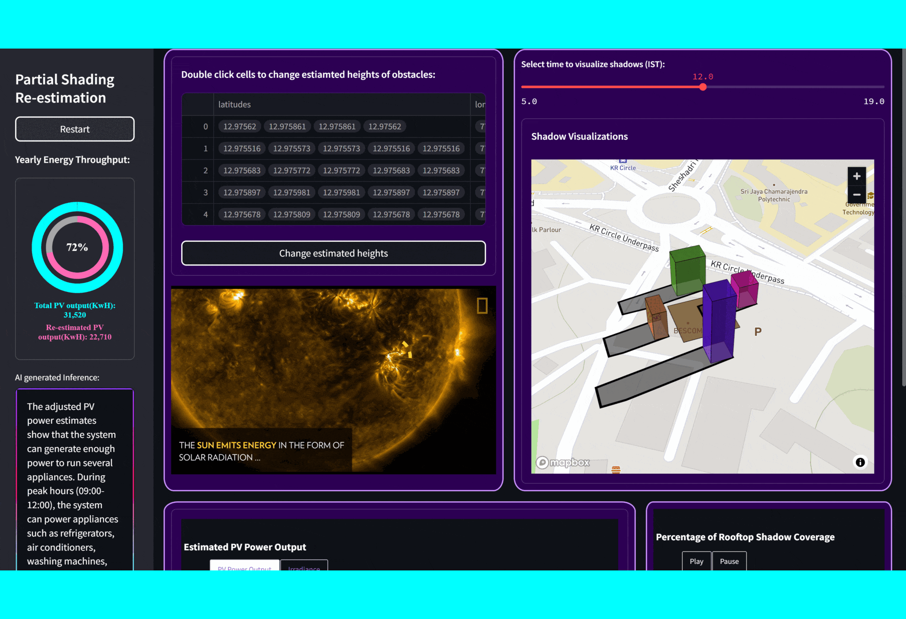

# SolarGIS
 Predicting Rooftop solar energy potential using real time solar irradiance data combined with extracted building footprints. Adjusting PV output taking into consideration partial shading originating from surrounding obstacles such as trees, buildings, etc. 

### Project Objectives:
•	Predicting the approximate power output specified number of PV modules can produce when installed on rooftops in given location while also estimating how partial shading can affect the total power generated. 
•	Aiding resource planners, ordinary citizens and startups to accurately predict solar energy outputs in urban settings, thereby aiding in transition to green energy and fulfillment of UN SDGs.
•	Building a deep learning model that can output the average solar energy potential of a day when provided with the area of rooftop, average solar irradiance in the location along with heights of objects obstructing sunlight in the specified area. 


## How to Run the App
To run the Streamlit app, open the terminal inside the folder and use the following command:

```bash
streamlit run solargis.py
```

### Library installations: 
```bash
pip install -r requirements.txt
```

Check out the open-source dataset: [Open Buildings](https://sites.research.google/open-buildings/)

## Deployment: 

Use Google cloud to deploy the project. Once you have configured google cloud project and sdk in your computer, use this command to deploy.
```bash
gcloud app deploy
```
Deployed version available on streamlit cloud but app doesn't run well due to cloud specifications.  

## Overview 

The details of the project are covered in this video : https://youtu.be/IiyKUs6mKco


## Gallery :
 


<br>


